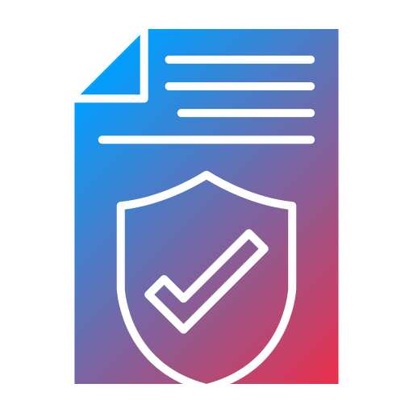

# Multimodal Legal Assistant



Legal and procurement teams can spend many hours reading long contracts. They
also need to connect each risk to the correct clause and page.

Multimodal Legal Assistant makes the first review faster. It reads digital PDFs,
scanned contracts, images, text, and Markdown. It finds contract risks, shows
the source evidence, and waits for a human decision.

This application supports legal review. It does not provide legal advice.

## How it helps

- Reads digital and scanned contracts
- Finds clauses about liability, termination, renewal, data, and indemnity
- Compares contract text with a company playbook
- Shows the exact quote and page for each finding
- Gives a risk level, confidence score, and recommended action
- Requires a person to approve or reject every review
- Measures precision, recall, citation coverage, speed, and errors

## Review process

1. A user uploads a contract or opens the sample agreement.
2. `pypdf` reads a digital PDF. Mistral OCR reads scans and images.
3. The application splits the text into page-based sections.
4. Mistral creates an embedding for each section.
5. Qdrant stores the text and embeddings.
6. CrewAI agents search the contract and check its clauses.
7. The application checks that every quote exists in the source document.
8. A human reviewer approves or rejects the result.

The application has one review process. All CrewAI agents use Mistral, and
contract search uses Qdrant.

## Main technology

- Python 3.12 and FastAPI
- CrewAI
- Mistral language model, OCR, and embeddings
- Qdrant
- SQLAlchemy and SQLite
- Next.js, React, and TypeScript
- Docker and GitHub Actions

## Start with Docker

1. Copy the environment file:

   ```bash
   cp .env.example .env
   ```

2. Add a Mistral API key to `.env`:

   ```env
   MISTRAL_API_KEY=your-key
   ```

3. Start all services:

   ```bash
   docker compose up --build
   ```

4. Open these pages:

   - Web application: `http://localhost:3000`
   - API documentation: `http://localhost:8000/docs`
   - Qdrant dashboard: `http://localhost:6333/dashboard`

5. Select **Load sample**, choose the agreement, and start a review.

## Local setup

Requirements:

- Python 3.12
- uv
- Node.js 24
- Docker
- A Mistral API key

Install the Python packages:

```bash
uv sync --all-groups
```

Install the frontend packages:

```bash
cd frontend
npm ci
cd ..
```

Start Qdrant:

```bash
docker compose up -d qdrant
```

Start the API:

```bash
uv run uvicorn app.main:app --reload --port 8000
```

Start the frontend in another terminal:

```bash
cd frontend
npm run dev
```

## Tests and checks

Run the Python tests and code check:

```bash
uv run pytest
uv run ruff check .
```

Run the frontend checks:

```bash
cd frontend
npm run lint
npm run typecheck
npm run build
```

## Vercel deployment

1. Import the repository into Vercel.
2. Set the Root Directory to `frontend`.
3. Add `NEXT_PUBLIC_API_URL`.
4. Set its value to the public FastAPI URL ending in `/api/v1`.
5. Deploy the project.

Vercel reads its settings from `frontend/vercel.json`.

## Environment settings

```env
MODEL_NAME=mistral-large-latest
MISTRAL_API_KEY=your-key
MISTRAL_OCR_MODEL=mistral-ocr-latest
MISTRAL_EMBEDDING_MODEL=mistral-embed

QDRANT_URL=http://localhost:6333
QDRANT_API_KEY=
QDRANT_COLLECTION_PREFIX=legal_contract
RETRIEVAL_TOP_K=6
RETRIEVAL_SCORE_THRESHOLD=0.2
```

Each contract has a separate Qdrant collection. This prevents text and vectors
from different contracts from being mixed.

## API routes

| Method | Route | Purpose |
| --- | --- | --- |
| `GET` | `/api/v1/health` | Check the application services |
| `POST` | `/api/v1/documents` | Upload and read a contract |
| `POST` | `/api/v1/documents/sample` | Load the sample agreement |
| `GET` | `/api/v1/documents` | List uploaded contracts |
| `POST` | `/api/v1/reviews` | Start a contract review |
| `GET` | `/api/v1/reviews` | List review results |
| `POST` | `/api/v1/reviews/{id}/decision` | Save a human decision |
| `GET` | `/api/v1/reviews/{id}/report` | Download an evidence report |
| `POST` | `/api/v1/evaluations/run` | Test the review process |

## Project structure

```text
multimodal-legal-assistant-crewai/
├── src/app/
│   ├── api/                  FastAPI routes
│   ├── core/                 Settings and logging
│   ├── crew/                 CrewAI agents and review process
│   ├── db/                   Database models and queries
│   ├── domain/               Shared schemas and values
│   └── services/             OCR, search, reviews, reports, and tests
├── tests/                    Python tests
├── frontend/
│   ├── app/                  Next.js pages and styles
│   ├── components/           User interface components
│   ├── lib/                  API client and shared types
│   ├── public/               Logo
│   └── vercel.json           Vercel settings
├── sample-data/              Sample contract, playbook, and test data
├── pyproject.toml
├── uv.lock
├── Dockerfile
└── docker-compose.yml
```

## Safety

- A finding without matching source text gets a lower confidence score.
- Every completed review stops at `needs_review`.
- The evidence report states that it is not legal advice.
- OCR, model, and search errors are shown clearly.
- Real contracts and API keys must not be added to the repository.
- Each company should follow its own security and data retention rules.

## Current limits

- The application does not include login or role-based access.
- Local development uses SQLite. A production system should use PostgreSQL.
- Reviews run in one request. A larger system should use background jobs.
- The included test data is synthetic and is not a legal benchmark.
- The sample playbook must not be used for a real contract.

## Next steps

- Add company workspaces and role-based access
- Add contract versions and redline comparison
- Add PostgreSQL migrations with Alembic
- Add background jobs and review progress
- Add more contract cases reviewed by legal experts

## Credits

[Legal document icon](https://www.flaticon.com/free-icon/legal-document_9372501)
created by
[Designing Hub](https://www.flaticon.com/authors/designing-hub) — Flaticon.

## License

MIT
